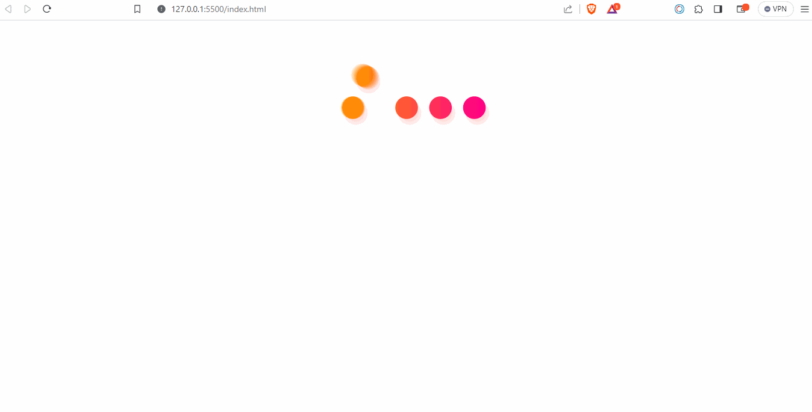

# Random Cat Images

# Pekiştirilmesi Beklenen Konular
- setTimeOut() & setInterval()
- fetch()
- .then() & .catch()
- Js DOM

# Beklenenler
- Sayfa açıldıktan 3sn sonra **loadingDiv** ekrandan kaybolsun **containerDiv** görünür hale gelsin.
- Aşağıda verilen api adresine fetch() ve .then() metodunu kullanarak istek atınız. Ayrıca hatayı yakalamak içinde .catch()metodunu zincire ekleyiniz. Gelen cevabı **cardDiv** içerisine yazdırınız.
- Sayfa yüklendiğinde resimler ekrana gelsin. Aynı şekilde kullanıcı **btn** elementine tıkladığında da istek atılsın resimler yenilensin.
- Eğer istekte hata meydana gelirse **cardDiv** içerisinde [hata resmi](./img/error.gif) ekrana gelsin.
- Apiden response gelene kadar **cardDiv** içerisinde [laoding resmi](./img/loading.gif) ekrana gelsin.
- **tarih** elementininin innerText ine anlık olarak tarih ve saat bilgisini yazdırınız.

## Beklenen Çıktı



## Demo

[Live](https://anthonyins.github.io/async-ass1/)

## Not:
1. Kullanacağınız API adresi => "https://api.thecatapi.com/v1/images/search?limit=10"
2. Verilen templatei tercih etmeyip kendinize göre oluşturabilirsiniz.
3. Resimleri ekrana yansıtmak için bu yapıyı kullanabilirsiniz:
```html
<div class="col-12 col-sm-6 col-lg-4">
      <div style="height:200px;">
        
      </div>
</div>

```