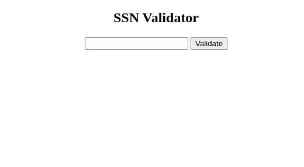

<p>Clarusway</p>

# JS-CC-01 : SSN (Social Security Number) Validator

The purpose of this coding challenge is to create a function that will check the given SSN (Social Security Number) is valid or not valid.



## Learning Outcomes

At the end of the this coding challenge, students will be able to;

- analyze a problem, identify and apply programming knowledge for appropriate solution.

- demonstrate their knowledge of algorithmic design principles by using JavaScript effectively.

## Problem Statement

Valid a SSN (Social Security Number);

- should have 9 digits. `522-82-5151`
- should be divided into 3 parts by hyphen (-).
- The first part should have 3 digits and should not be 000, 666, or between 900 and 999.
- The second part should have 2 digits and it should be from 01 to 99.
- The third part should have 4 digits and it should be from 0001 to 9999.

### Random Valid SSN numbers to check with your code:

```plain text	
268-26-3556
237-86-7532
304-92-5339
510-72-0765
504-58-0987
```

<p align='center'><strong> ⌛ Happy Coding  ✍ </strong></p>

