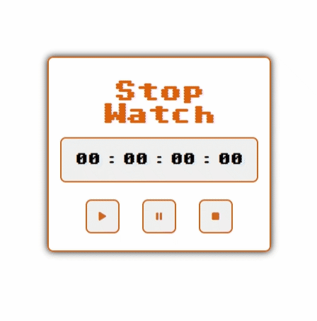

Clarusway

 

# JS-CC-06: Stopwatch

## Assignment Description

- Time to put your newly acquired skills into action! 

- Your task is to create a web page featuring a functional stopwatch.

## Submission Guidelines

- Students are required to push their solutions to their individual public GitHub repositories.

## Learning Objectives

Upon completion of this coding challenge, students should be able to:

- Analyze a problem, identify programming solutions, and apply appropriate programming knowledge.
- Demonstrate proficiency in algorithmic design principles using JavaScript effectively.

## Expected Outcome

## Problem Statement

- Create a web page
  - Write HTML code to structure the web page.
  - Add CSS to enhance the visual appeal of your web page.

-Write javaScript code
  - Write JavaScript code to create a fully functional stopwatch.

- Feel free to get creative with your design and add additional features to make your stopwatch unique. Good luck!

<strong> ⌛ Happy Coding  ✍ </strong>

